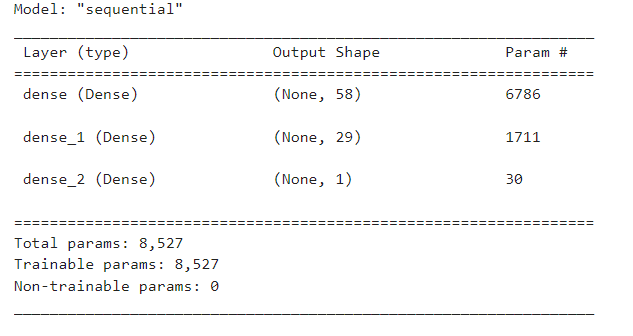
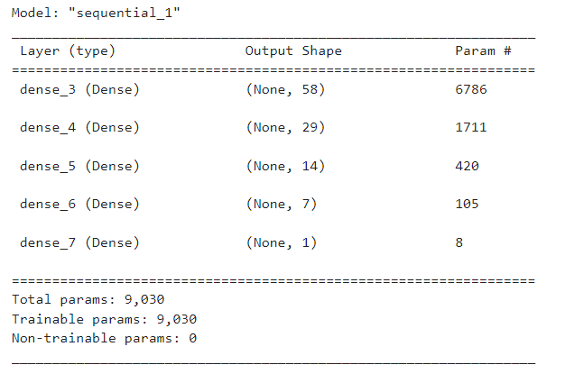
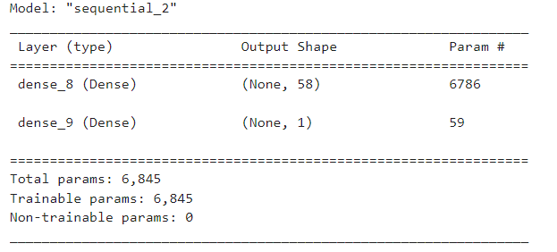
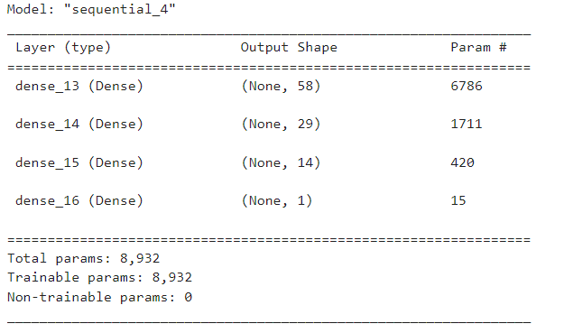

# Challenge 13 Venture Funding with Deep Learning

## Introduction
This project explores machine learning using Jupyter Labs, SK Learn, and TensorFlow.

## Data
The data set we are using in this project contains over 34,000 organizations that had received funding from Alphabet soup and have been evaluated as being successful or not.  We use this data to build a model to help predict future endevors.

Here is our original model, with two hidden layers and an accuracy of 72.84%.

In order to increase the accuracy of the model I decided to add and subtract hidden layers to re-evaluate the accuracy.

4 hidden layers, 73.06% accuracy.

1 hidden layer, 72.87% accuracy.

3 hidden layers, 73.06% accuracy.

## Conclusion
Adding and subtracting hidden layers to this model didn't have a major impact on the accuracy.